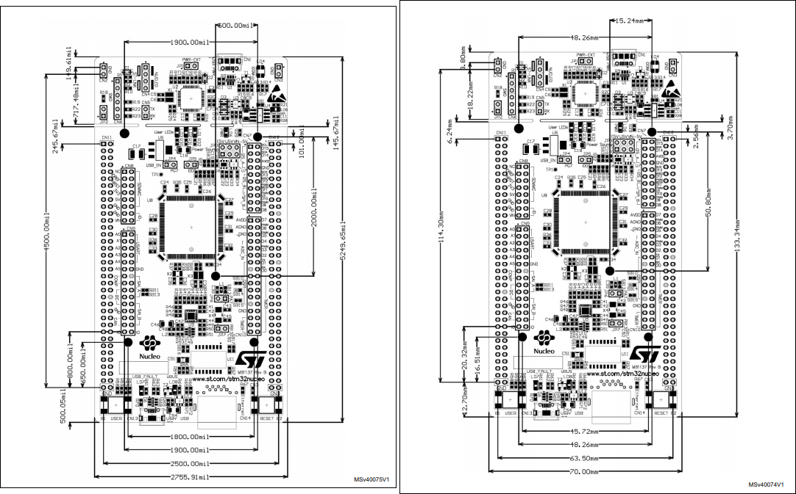
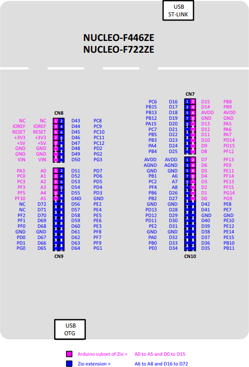
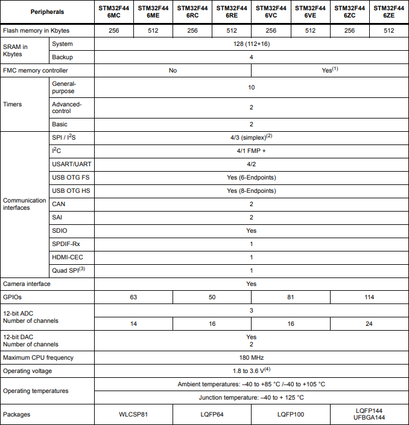

# MCU And Board

The board used is [Nucleo F446ZE](https://www.st.com/en/evaluation-tools/nucleo-f446ze.html),
with [STM32F446ZET](https://www.st.com/en/microcontrollers-microprocessors/stm32f446ze.html) MCU.

## Board Mechanical Drawing in mil

## Board Pin Mapping

## MCU Features and Peripherals

